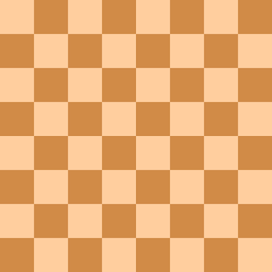
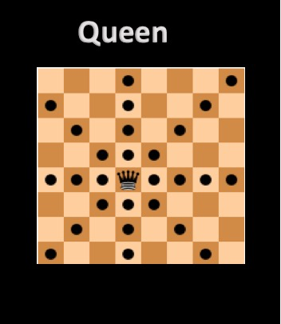
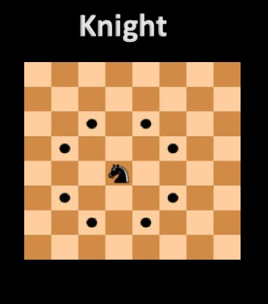
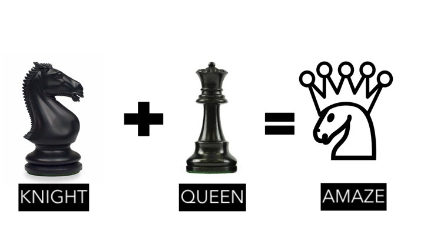
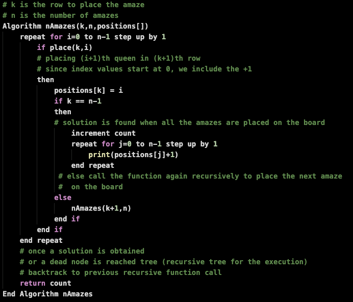
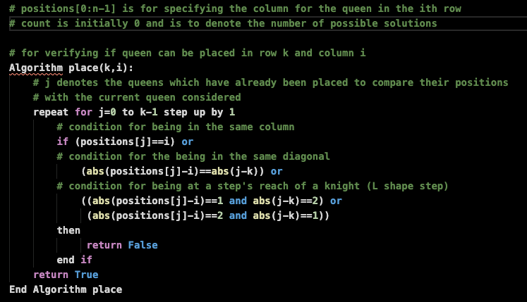
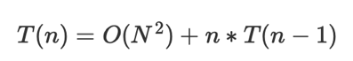
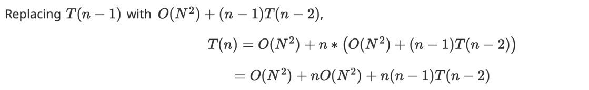
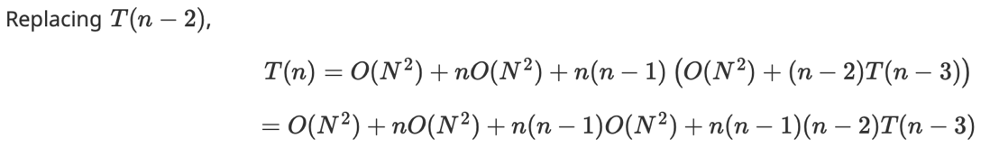
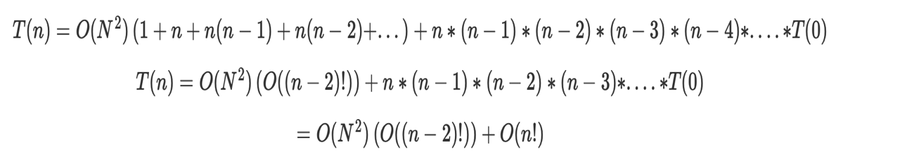

# The Amaze Chess Piece Problem
  The Amaze Chess Piece Problem requires the player to place n number of amaze chess pieces in a nxn chessboard so that no two amazes attack each other.

Just in case if you ain't familiar with the terms of chess, let's just run a quick run through the terms that we wil be using in this scenario. 
## Chessboard
A chessboard is simply a square board consisting of nxn smaller evenly sized squares each of which can accomodate a chess piece.
Consider a sample 8x8 chessboard as shown below.

## The Queen
The queen chess piece has the power to move any number of steps either forward or backward in the vertical, horizontal and diagonal directions. The queen can the power to attack any rival chess piece that lies in its path.

## The Knight
The knight chess piece has the power to move in a 'L' shape with two steps in either of the four directions and then take one step to the left or right. The knight cannot make any diagonal steps. The knight can also, attack any rival chess piece that lies in its path.

## The Amaze
An 'Amaze' is a chess piece that has the combined powers of both a queen and a knight in the game of chess.

## Placing Amazes in a 12x12 Chessboard
Let us consider n to be 12 and hence the case of placing amazes in a 12x12 chessboard.
* Since there are only 12 rows in a 12x12 chessboard and only one amaze can be placed in a row, a total of only __12 amazes can be placed in the 12x12__ board without one attacking the other.
* For the 12 amazes, the __i'th amaze will be placed in the i'th row__. We just have to find out the column number (stored as its position) for placing the corresponding amaze.
* __Backtracking approach__ is used in the algorithm to solve this problem.
  * We start by placing one amaze and then call the algorithm again recursively to place the next amaze piece.
  * __Backtracking :__ In case an amaze cannot be placed anywhere amongst the 12 columns, we return back to the previous function call and change the position (column) of the previous amaze piece. 

## Algorithms

## nAmazes
* The __'nAmazes' function__ is used for the backtracking solution logic.

## place
* The __'place' function__ is used for finding if the amaze piece can be placed at a certain square in the chessboard.

## Tracing the Recursions

## Can you guess how many such possible solutions are there?
# A whopping __156__ different solutions!

## Complexity Analysis

* __Space Complexity : O(n)__
* __Time Complexity  : O(n!)__

  By backward substitution method...
  * 
  * 
  * 
  * 
